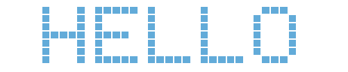

# js-html-led-panel

Hi there! 

I created this project to try to emulate a simple led panel with only capital letters. In the preview image below, you can see what a working led panel looks like after opening the src/LedPanelDemo.html file<br>

Feel free to use my code and modify it as you see fit if you want!

---

|||
|-|-|
| Author: | Filip Janoušek |
| Alias: | Saburo Toshiro |
| Time: | ~ 4 hours |




---
Look at config object in src/LedPanelDemo.html in which you can set more options include text. <br>
If you want to use lowercase or another chars, you must to added to charset.js
```
const ledPanelConfig = {
    speed: 150, // in milliseconds
    message: ' HELLO ', // text for led panel, only uppercase letters and characters (., -, whitespace) are allowed
    cols: 150, // number of cols in table
    rows: 7, // number of rows in table
    colorBackground: '#FFF', // color of background
    colorAlphabet: '#62ABD9', // color of alphabet
    idContainer: 'myLedPanel' 
}
```